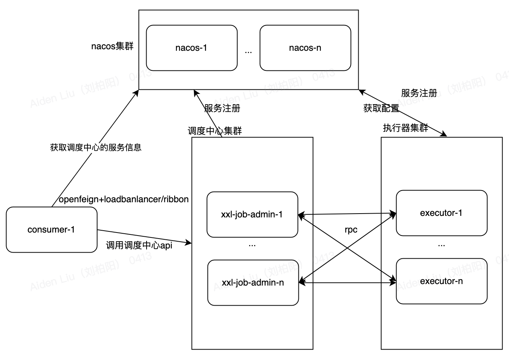
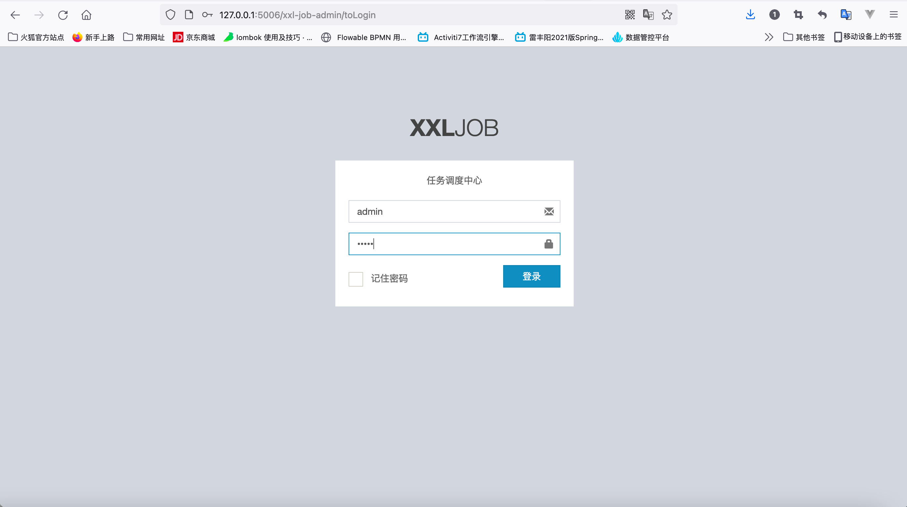
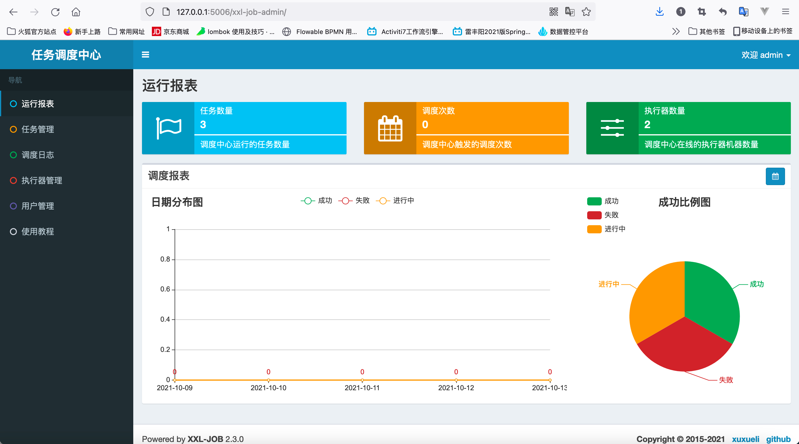
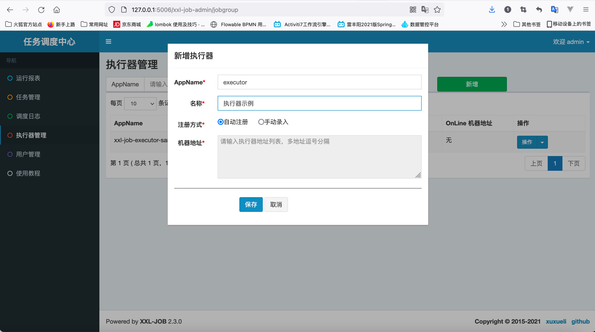
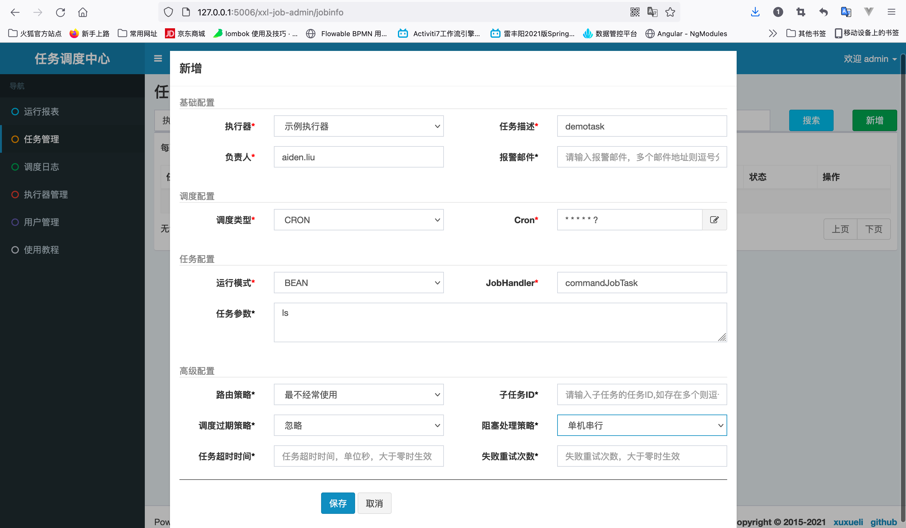

# xxl-job-demo

> 此 demo 主要演示了 Spring cloud 如何集成 XXL-JOB 实现分布式定时任务，并提供绕过 `xxl-job-admin` 对定时任务的管理的方法，包括定时任务列表，触发器列表，新增定时任务，删除定时任务，停止定时任务，启动定时任务，修改定时任务，手动触发定时任务。
<p align="center">
 
 
 
 
 
    
</p>

## xxl-job集成nacos架构图

> clone下来的项目源码已经可以用了，下面的1-4是改造xxl-job以及改造执行器的步骤。
> 若不关心改造过程，可直接使用，详见《启动步骤》

## 启动步骤
- 执行 /sql/xxl-job.sql -- 调度中心的sql脚本
- 启动nacos  
- RUN XxlJobAdminApplication  --调度中心
- RUN ExecutorApplication  --执行器
- RUN ConsumerApplication  --消费者

## 1. xxl-job-admin调度中心

> https://github.com/xuxueli/xxl-job.git

克隆 调度中心代码

```bash
$ git clone https://github.com/xuxueli/xxl-job.git
```

### 1.1. 创建调度中心的表结构

数据库脚本地址：`/xxl-job/doc/db/tables_xxl_job.sql`

### 1.2. 修改 application.properties

```properties
server.port=18080

spring.datasource.url=jdbc:mysql://127.0.0.1:3306/xxl_job?Unicode=true&characterEncoding=UTF-8&useSSL=false
spring.datasource.username=root
spring.datasource.password=root
```

### 1.3. 修改日志配置文件 logback.xml

```xml
<property name="log.path" value="logs/xxl-job/xxl-job-admin.log"/>
```

### 1.4. 启动调度中心

Run `XxlJobAdminApplication`

默认用户名密码：admin/admin



## 2. 编写执行器项目

### 2.1. pom.xml

```xml
<?xml version="1.0"?>
<project xmlns="http://maven.apache.org/POM/4.0.0"
         xmlns:xsi="http://www.w3.org/2001/XMLSchema-instance"
         xsi:schemaLocation="http://maven.apache.org/POM/4.0.0
            http://maven.apache.org/xsd/maven-4.0.0.xsd">
    <modelVersion>4.0.0</modelVersion>
    <parent>
        <groupId>com.cloudwise</groupId>
        <artifactId>xxl-job-demo</artifactId>
        <version>1.0.0</version>
    </parent>

    <artifactId>executor</artifactId>
    <packaging>jar</packaging>

    <description>xxl-job executor</description>


    <dependencies>
        <!-- 注册中心客户端-->
        <dependency>
            <groupId>com.alibaba.cloud</groupId>
            <artifactId>spring-cloud-starter-alibaba-nacos-discovery</artifactId>
        </dependency>
        <!-- 配置中心客户端-->
        <dependency>
            <groupId>com.alibaba.cloud</groupId>
            <artifactId>spring-cloud-starter-alibaba-nacos-config</artifactId>
        </dependency>
        <!-- undertow容器-->
        <dependency>
            <groupId>org.springframework.boot</groupId>
            <artifactId>spring-boot-starter-undertow</artifactId>
        </dependency>
        <!--hutool-->
        <dependency>
            <groupId>cn.hutool</groupId>
            <artifactId>hutool-all</artifactId>
            <version>${hutool.version}</version>
        </dependency>
        <dependency>
            <groupId>com.cloudwise</groupId>
            <artifactId>common</artifactId>
        </dependency>
        <dependency>
            <groupId>com.xuxueli</groupId>
            <artifactId>xxl-job-core</artifactId>
            <version>2.3.0</version>
        </dependency>
        <dependency>
            <groupId>org.springframework.boot</groupId>
            <artifactId>spring-boot-starter-web</artifactId>
        </dependency>
    </dependencies>

    <build>
        <plugins>
            <plugin>
                <groupId>org.springframework.boot</groupId>
                <artifactId>spring-boot-maven-plugin</artifactId>
            </plugin>
            <plugin>
                <groupId>io.fabric8</groupId>
                <artifactId>docker-maven-plugin</artifactId>
            </plugin>
        </plugins>
    </build>

</project>

```

### 2.2. 执行器开启xxl-job能力，添加@EnableXxlJob注解

```java
/**
 * @author aiden
 * <p>
 * 项目启动类
 */
@EnableDiscoveryClient
@SpringBootApplication
@EnableXxlJob
class ExecutorApplication {
    public static void main(String[] args) {
        SpringApplication.run(ExecutorApplication.class, args);
    }

}
```

### 2.3. 编写配置文件 application.yml

```yaml
server:
  port: 8080
  servlet:
    context-path: /demo
xxl:
  job:
    # 执行器通讯TOKEN [选填]：非空时启用；
    access-token:
    admin:
      # 调度中心部署跟地址 [选填]：如调度中心集群部署存在多个地址则用逗号分隔。执行器将会使用该地址进行"执行器心跳注册"和"任务结果回调"；为空则关闭自动注册；
      address: http://localhost:18080/xxl-job-admin
    executor:
      # 执行器AppName [选填]：执行器心跳注册分组依据；为空则关闭自动注册
      app-name: spring-boot-demo-task-xxl-job-executor
      # 执行器IP [选填]：默认为空表示自动获取IP，多网卡时可手动设置指定IP，该IP不会绑定Host仅作为通讯实用；地址信息用于 "执行器注册" 和 "调度中心请求并触发任务"；
      ip:
      # 执行器端口号 [选填]：小于等于0则自动获取；默认端口为9999，单机部署多个执行器时，注意要配置不同执行器端口；
      port: 9999
      # 执行器运行日志文件存储磁盘路径 [选填] ：需要对该路径拥有读写权限；为空则使用默认路径；
      log-path: logs/spring-boot-demo-task-xxl-job/task-log
      # 执行器日志保存天数 [选填] ：值大于3时生效，启用执行器Log文件定期清理功能，否则不生效；
      log-retention-days: -1
```

### 2.4. 自动装配逻辑关键代码
module：common - @EnableXxlJob
```java
/**
 *
 * 激活xxl-job配置
 * @author aiden
 * @date 2021/9/29 3:45 下午
 * @return
 */
@Target({ ElementType.TYPE })
@Retention(RetentionPolicy.RUNTIME)
@Documented
@Inherited
@Import({ XxlJobAutoConfiguration.class })
public @interface EnableXxlJob {

}
```
module：executor - XxlJobAutoConfiguration.java
```java
/**
*
* xxl-job自动装配
* @author aiden
* @date 2021/9/29 4:38 下午
* @return
  */
  @Configuration(proxyBeanMethods = false)
  @EnableAutoConfiguration
  @EnableConfigurationProperties(XxlJobProperties.class)
  public class XxlJobAutoConfiguration {

  /**
    * 服务名称 包含 XXL_JOB_ADMIN 则说明是 Admin
      */
      private static final String XXL_JOB_ADMIN = "xxl-job-admin";

  /**
    * 配置xxl-job 执行器，提供自动发现 xxl-job-admin 能力
    * @param xxlJobProperties xxl 配置
    * @param environment 环境变量
    * @param discoveryClient 注册发现客户端
    * @return
      */
      @Bean
      public XxlJobSpringExecutor xxlJobSpringExecutor(XxlJobProperties xxlJobProperties, Environment environment,
      DiscoveryClient discoveryClient) {
      XxlJobSpringExecutor xxlJobSpringExecutor = new XxlJobSpringExecutor();
      XxlExecutorProperties executor = xxlJobProperties.getExecutor();
      // 应用名默认为服务名
      String appName = executor.getAppname();
      if (!StringUtils.hasText(appName)) {
      appName = environment.getProperty("spring.application.name");
      }
      xxlJobSpringExecutor.setAppname(appName);
      xxlJobSpringExecutor.setAddress(executor.getAddress());
      xxlJobSpringExecutor.setIp(executor.getIp());
      xxlJobSpringExecutor.setPort(executor.getPort());
      xxlJobSpringExecutor.setAccessToken(executor.getAccessToken());
      xxlJobSpringExecutor.setLogPath(executor.getLogPath());
      xxlJobSpringExecutor.setLogRetentionDays(executor.getLogRetentionDays());

      // 如果配置为空则获取注册中心的服务列表 "http://nacos:8848/xxl-job-admin"
      if (!StringUtils.hasText(xxlJobProperties.getAdmin().getAddresses())) {
      String serverList = discoveryClient.getServices().stream().filter(s -> s.contains(XXL_JOB_ADMIN))
      .flatMap(s -> discoveryClient.getInstances(s).stream()).map(instance -> String
      .format("http://%s:%s/%s", instance.getHost(), instance.getPort(), XXL_JOB_ADMIN))
      .collect(Collectors.joining(","));
      xxlJobSpringExecutor.setAdminAddresses(serverList);
      }
      else {
      xxlJobSpringExecutor.setAdminAddresses(xxlJobProperties.getAdmin().getAddresses());
      }

      return xxlJobSpringExecutor;
      }

}
```

### 2.5. 编写具体的定时逻辑 DemoTask.java

```java
/**
 * @author： aiden
 * @description：
 * @date： 2021/9/23 5:21 下午
 */
@Component
public class DemoTask{

    @Value("${executor.desc}")
    private String desc;

    @XxlJob(value = "demoTask")
    public void demoTask() throws Exception {
        String jobParam = XxlJobHelper.getJobParam();
        System.out.println(jobParam);
        int i = 0;
        if("error".equals(desc)){
            XxlJobHelper.log(new RuntimeException("the ${executor.desc} value can not be error"));
        }else{
            while (i<100){
                XxlJobHelper.log(desc + i);
                i++;
            }
            XxlJobHelper.handleSuccess("任务执行成功");
        }
    }

    @XxlJob(value = "commandJobTask")
    public void commandJobTask() throws Exception {
        String command = XxlJobHelper.getJobParam();
        Process exec = RuntimeUtil.exec(command); }
}
```

### 2.6. 启动执行器

Run `ExecutorApplication`

## 3. 配置定时任务

### 3.1. 将启动的执行器添加到调度中心

执行器管理 - 新增执行器


### 3.2. 添加定时任务

任务管理 - 新增 - 保存


### 3.3. 启停定时任务

任务列表的操作列，拥有以下操作：执行、启动/停止、日志、编辑、删除

执行：单次触发任务，不影响定时逻辑

启动：启动定时任务

停止：停止定时任务

日志：查看当前任务执行日志

编辑：更新定时任务

删除：删除定时任务

## 4. 使用API添加定时任务

> 实际场景中，如果添加定时任务都需要手动在 xxl-job-admin 去操作，这样可能比较麻烦，用户更希望在自己的页面，添加定时任务参数、定时调度表达式，然后通过 API 的方式添加定时任务

### 4.1. 改造xxl-job-admin

#### 4.1.1. 修改 JobGroupController.java

```java
...
// 添加执行器列表
@RequestMapping("/list")
@ResponseBody
// 去除权限校验
@PermissionLimit(limit = false)
public ReturnT<List<XxlJobGroup>> list(){
		return  new ReturnT<>(xxlJobGroupDao.findAll());
}
...
```

#### 4.1.2. 修改 JobInfoController.java

```java
// 分别在 pageList、add、update、remove、pause、start、triggerJob 方法上添加注解，去除权限校验
@PermissionLimit(limit = false)
```

### 4.2. 改造 执行器项目

#### 4.2.1. 添加手动触发类

```java
/**
 * <p>
 * 手动操作 xxl-job
 * </p>
 *
 * @author aiden
 */
@Slf4j
@RestController
@RequestMapping("/xxl-job")
//@RequiredArgsConstructor(onConstructor_ = @Autowired)
public class ManualOperateController {
    private final static String JOB_GROUP_URI = "/jobgroup";
    private final static String XXL_JOB_ADMIN = "http://xxl-job-admin/xxl-job-admin";

    @Autowired
    private RestTemplate restTemplate;

    @Autowired
    private XxlJobAdminClinet xxlJobAdminClinet;

    /**
     * 任务组列表，xxl-job叫做触发器列表
     */
    @GetMapping("/group")
    public Object xxlJobGroup() {
        HashMap reponse = restTemplate.getForObject( XXL_JOB_ADMIN + JOB_GROUP_URI + "/list", HashMap.class);
        log.info("【execute】= {}", reponse);
        return reponse;
    }

    /**
     * 分页任务列表
     *
     * @param page 当前页，第一页 -> 0
     * @param size 每页条数，默认10
     * @return 分页任务列表
     */
    @GetMapping("/list")
    public Object xxlJobList(Integer page, Integer size) {
        Map<String, Object> jobInfo = Maps.newHashMap();
        jobInfo.put("start", page != null ? page : 0);
        jobInfo.put("length", size != null ? size : 10);
        jobInfo.put("jobGroup", 2);
        jobInfo.put("triggerStatus", -1);

        HashMap reponse = xxlJobAdminClinet.jobInfoPageList(jobInfo);
        log.info("【reponse】= {}", reponse);
        return reponse;
    }

    /**
     * 测试手动保存任务
     */
    @GetMapping("/add")
    public Object xxlJobAdd() {
        Map<String, Object> jobInfo = Maps.newHashMap();
        jobInfo.put("jobGroup", 2);
        jobInfo.put("scheduleType", "CRON");
        jobInfo.put("scheduleConf", "0 0/1 * * * ? *");
        jobInfo.put("jobDesc", "手动添加的任务");
        jobInfo.put("author", "admin");
        jobInfo.put("executorRouteStrategy", "ROUND");
        jobInfo.put("misfireStrategy", "DO_NOTHING");
        jobInfo.put("executorHandler", "demoTask");
        jobInfo.put("executorParam", "手动添加的任务的参数");
        jobInfo.put("executorBlockStrategy", ExecutorBlockStrategyEnum.SERIAL_EXECUTION);
        jobInfo.put("glueType", GlueTypeEnum.BEAN);

        HashMap reponse = xxlJobAdminClinet.add(jobInfo);
        log.info("【reponse】= {}", reponse);
        return reponse;
    }

    /**
     * 测试手动触发一次任务
     */
    @GetMapping("/trigger")
    public Object xxlJobTrigger() {
        Map<String, Object> jobInfo = Maps.newHashMap();
        jobInfo.put("id", 2);
        jobInfo.put("executorParam", JSONUtil.toJsonStr(jobInfo));

        HashMap reponse = xxlJobAdminClinet.trigger(jobInfo);
        log.info("【reponse】= {}", reponse);
        return reponse;
    }

    /**
     * 测试手动删除任务
     */
    @GetMapping("/remove")
    public Object xxlJobRemove() {
        Map<String, Object> jobInfo = Maps.newHashMap();
        jobInfo.put("id", 2);

        HashMap reponse = xxlJobAdminClinet.remove(jobInfo);
        log.info("【reponse】= {}", reponse);
        return reponse;
    }

    /**
     * 测试手动停止任务
     */
    @GetMapping("/stop")
    public Object xxlJobStop() {
        Map<String, Object> jobInfo = Maps.newHashMap();
        jobInfo.put("id", 2);

        HashMap reponse = xxlJobAdminClinet.stop(jobInfo);
        log.info("【reponse】= {}", reponse);
        return reponse;
    }

    /**
     * 测试手动启动任务
     */
    @GetMapping("/start")
    public Object xxlJobStart() {
        Map<String, Object> jobInfo = Maps.newHashMap();
        jobInfo.put("id", 2);

        HashMap reponse = xxlJobAdminClinet.start(jobInfo);
        log.info("【reponse】= {}", reponse);
        return reponse;
    }

}

```

> 具体细节请查看代码

## 参考

- [《分布式任务调度平台xxl-job》](http://www.xuxueli.com/xxl-job/#/)
- [pig:宇宙最强微服务认证授权脚手架(架构师必备)](https://github.com/pigxcloud/pig)
- [spring-boot-demo/tree/master/demo-task-xxl-job](https://github.com/xkcoding/spring-boot-demo/tree/master/demo-task-xxl-job)

